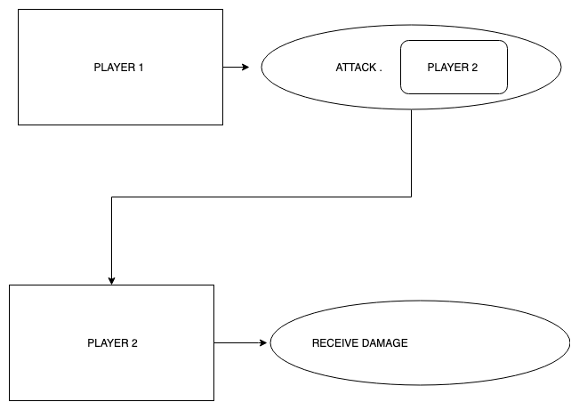

```
As Player 1,
So I can start to win a game of Battle,
I want my attack to reduce Player 2's HP
```
```
As Player 1,
So I can start to win a game of Battle,
I want my attack to reduce Player 2's HP by 10
```

Player 1 attacks. Call Player 1 attack method with player 2 as an argument.
-
Player 2 HP reduces by 10. Call Player 2 receive damage method.


